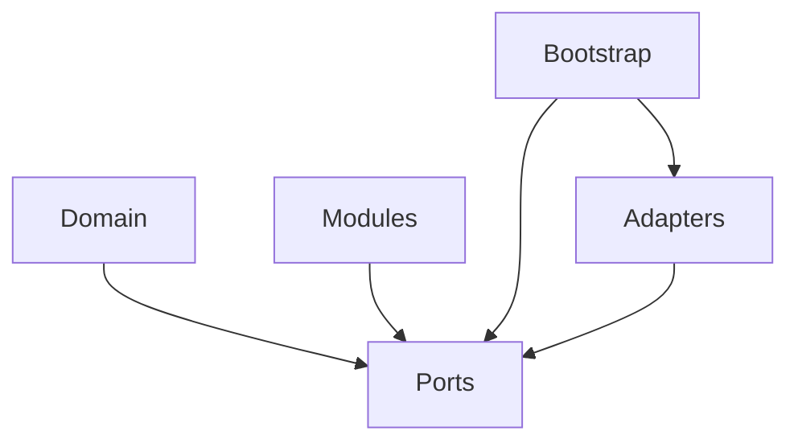

# Nektar Foundation Scaffold

Greenfield: the repo currently contains only [.cursor/lld.md](.cursor/lld.md). This plan lays the **foundation only** — everything compiles and boots, but business logic inside `modules/` is intentionally left as empty handler stubs.

## Architecture (target layout)

Following the LLD's final Ports & Adapters recommendation ([.cursor/lld.md](.cursor/lld.md) lines 543-575):

```text
nektar/
  cmd/nektar/main.go
  internal/
    modules/           # business capabilities (empty handler stubs for now)
      fetcher/ extractor/ embedding/ clustering/ digest/ publisher/
    ports/             # interfaces (contracts) only
      eventbus/ llm/ email/ repository/ cache/ publisher/
    adapters/          # implementations
      inmemory/ redis/ postgres/ gmail/ gemini/ discord/
    bootstrap/         # config-driven dependency wiring
    platform/          # cross-cutting: logger, config, scheduler, metrics
  shared/
    domain/ events/
  configs/config.yaml
  deployments/docker-compose.yaml
```

Dependency rule (LLD lines 521-539): `modules` and `shared/domain` import only `ports`, never `adapters`.



## Tech choices (reasonable defaults, adjustable)

- Module path `github.com/sagarbera/nektar`, Go 1.23+.
- Config: `spf13/viper` (YAML + env override), config-driven provider selection per LLD lines 410-442.
- Event bus Redis + cache Redis: `redis/go-redis/v9`.
- Storage: `jackc/pgx/v5` for PostgreSQL.
- Logger: stdlib `log/slog`. Metrics: `prometheus/client_golang`.
- Gmail: `google.golang.org/api/gmail/v1` + `golang.org/x/oauth2`. Gemini: `google.golang.org/genai`. Discord: webhook via stdlib `net/http` (no heavy dep).

## Scope boundaries

- **In scope:** repo layout, `go.mod`, config, all port interfaces, event bus (in-memory + Redis Streams w/ consumer groups/ACK/DLQ), provider factory/registry, bootstrap wiring, skeleton adapters that satisfy interfaces (real client setup where trivial, `ErrNotImplemented` for methods needing business logic), logger/metrics/scheduler platform pieces, docker-compose (redis + postgres), Makefile, README.
- **Out of scope (deferred):** actual fetch/extract/embed/cluster/digest logic, Kafka/NATS/Outlook/IMAP/OpenAI/Claude/Ollama/Slack/Telegram/SQLite adapters, DB migrations content beyond initial schema, auth/token flows beyond config plumbing.

## Key interfaces to define (from LLD)

- `EventBus` (Publish/Subscribe/Close), `Event` (Name/Payload), `Handler` — lines 168-201.
- `llm.Provider` (Embed/Summarize) — lines 287-299.
- `email.Provider` (Fetch) — lines 315-333.
- `repository`: `ArticleRepository`, `DigestRepository`, `EmailRepository` — lines 337-359.
- `cache.Cache` (Get/Set/Delete) — lines 363-385.
- `publisher.Publisher` — lines 388-406.
- `shared/events`: `EmailFetched`, `ArticleCreated`, `EmbeddingCreated`, `ClusterUpdated`, `DigestReady` — lines 205-211, 488-515.

## Bootstrap flow (LLD lines 446-517)

`main.go` -> load config -> build storage -> event bus -> cache -> llm -> publishers -> register handlers (stubs) -> start workers/scheduler.